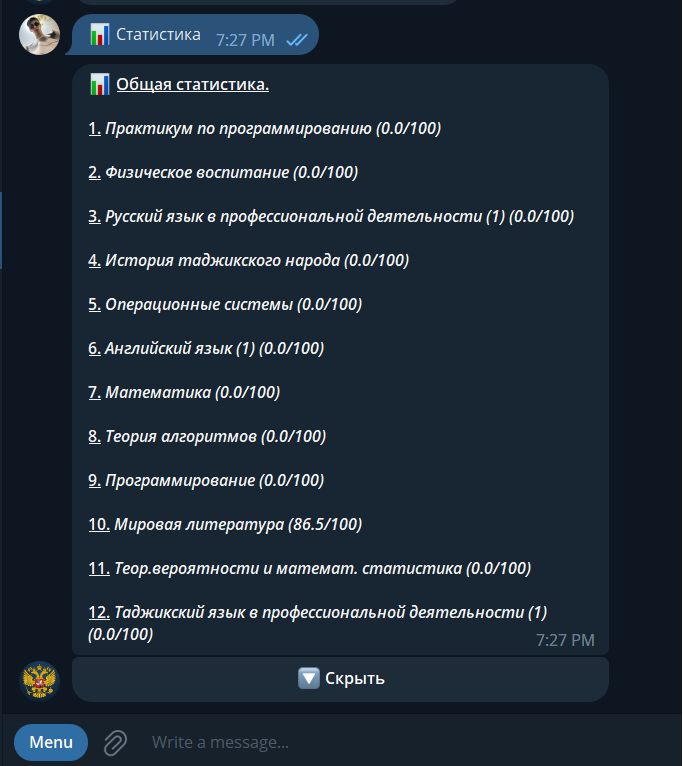
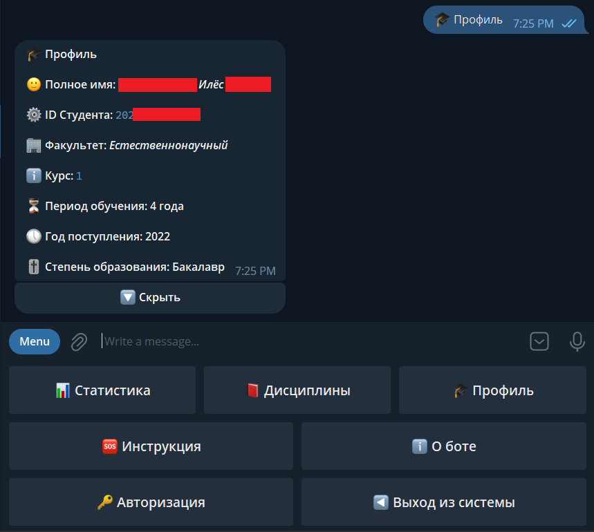
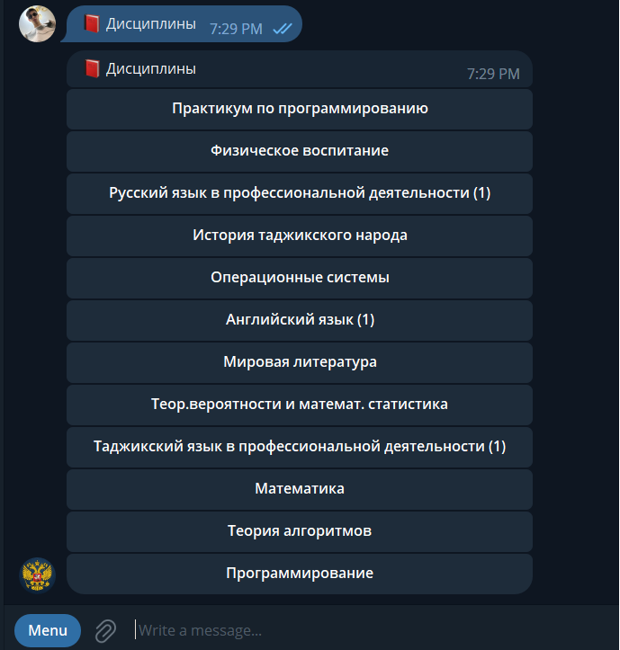
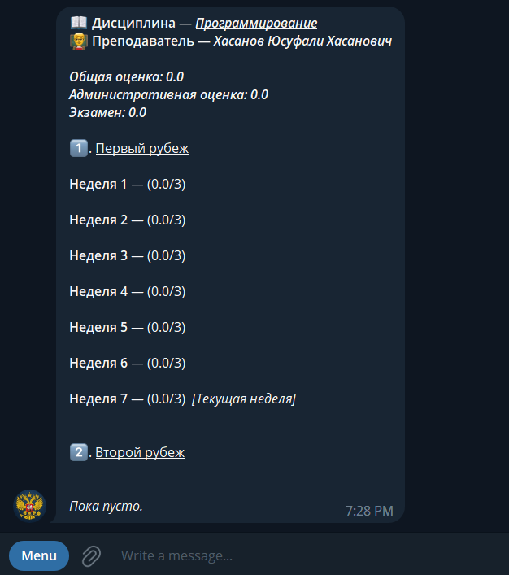

# RtsuStudentsBot

Just telegram bot for replacing official application of RTSU Univercity 

# Overview

Bot can provide you information about
<ul>
  <li>Common statistics</li>
  <li>Statistics of concrete subject</li>
  <li>Your profile in RTSU Univercity</li>
</ul>

### Screenshots

### Statistics



### Profile



### Subjects



### Statistics on concrete subject



# ⚙️ Setup

### 🚀 For running project, you must have an installed poetry
#### ⚠️ Skip this if you have already installed poetry. 

##### MacOS/Linux and other Unix

```bash
curl -sSL https://install.python-poetry.org | python3 -
```
##### Windows

```powershell
(Invoke-WebRequest -Uri https://install.python-poetry.org -UseBasicParsing).Content | py -
```

#### Clone repository

```bash
git clone https://github.com/ilyas-kalandar/RtsuStudentsBot
cd RtsuStudentsBot
```

#### Install dependencies

```bash
poetry install
```

#### 🧪 Running tests

##### Create configuration for testing

```bash
touch testing_settings.json
```

Paste this to file

```json
{
  "db_url": "sqlite+aiosqlite:///testdb.db",
  "rtsu_api_login": "Your rtsu-login",
  "rtsu_api_password": "Your rtsu-password"
}
```

#### Run tests

```bash
poetry run pytest
```

### 🚀 Starting bot

#### ⚙️ Configuration

Create settings file
```bash
touch settings.json
```

Paste your config to file <br/>
I use this configuration as example

```json
{
  "bot": {
    "token": "Paste your token"
  },
  "logging": {
    "debug": false,
    "format": "[%(asctime)s] - |%(levelname)s| - %(message)s"
  },
  "db": {
    "url": "sqlite+aiosqlite:///data.db"
  }
}
```

For webhooks pass webhook's settings
```json
{
  "bot": {
    "token": "Your token"
  },
  "logging": {
    "debug": false,
    "format": "[%(asctime)s] - |%(levelname)s| - %(message)s"
  },
  "db": {
    "url": "sqlite+aiosqlite:///data.db"
  },
  "webhooks": {
    "host": "Your host",
    "path": "/bot",
    "webapp_host": "localhost",
    "webapp_port": 80
  }
}

```
#### Open poetry-shell

```bash
poetry shell
```

#### Start bot

```bash
poetry run bot 
```

#### Start bot using webhooks

```bash
poetry run bot --use-webhooks
```

#### Skipping updates
```bash
poetry run bot --skip-updates
```

Ilyas Qalandarzoda (C), 2023.
